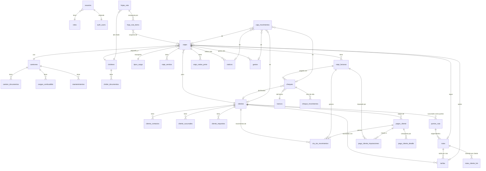

# Sistema Don Joaquín — Esquema de Base de Datos

> **Documento de referencia para agentes/devs.** Antes de escribir código que interactúe con la BD (queries, mutaciones, módulos nuevos), lee este archivo. Las migraciones canónicas viven en [`supabase/migrations/`](../supabase/migrations).

## Stack

- **Motor:** PostgreSQL 15 (Supabase managed)
- **Cliente:** `@supabase/supabase-js` + `@supabase/ssr` (Next.js App Router)
- **Auth:** Supabase Auth (`auth.users` con bcrypt)
- **Storage:** Supabase Storage (7 buckets privados)
- **Seguridad:** Row Level Security activo en todas las tablas

---

## Convenciones del esquema

Reglas que se aplican a **todas** las tablas. No las repitas en cada query.

### Identificadores

- **PKs:** `uuid` con `DEFAULT gen_random_uuid()` (nunca `serial`/`bigserial`)
- **FKs:** siempre `uuid REFERENCES tabla(id)`
- **Naming:** snake_case, plurales para tablas (`viajes`, `clientes`)

### Timestamps

- Toda tabla con datos editables tiene `created_at timestamptz NOT NULL DEFAULT now()`
- Tablas con flujo de actualización tienen `updated_at timestamptz` mantenido por trigger automático (`trigger_set_updated_at`). **No actualizar `updated_at` manualmente.**
- Auditoría/inserción única (audit_log, cheque_movimientos, caja_movimientos, cta_cte_movimientos): solo `created_at`.

### Auditoría de creación

Tablas operativas tienen `created_by uuid REFERENCES usuarios(id)`. Setealo desde la app con `auth.uid()`.

### Saldos calculados on-the-fly

**No existen columnas de saldo persistentes.** Los saldos se calculan siempre con queries:
- Cuenta corriente: usar la vista `v_cliente_saldo`
- Caja general: usar la vista `v_caja_saldo`
- Saldo de factura: usar la vista `v_factura_saldo`
- Km actual de camión: usar la vista `v_camion_km_actual`

### Multimoneda

Cualquier tabla con valor monetario tiene:
- `moneda char(3) NOT NULL DEFAULT 'ARS'` (ISO-4217)
- `tipo_cambio numeric(10,4)` cuando aplica (snapshot al momento del registro)

**Reglas:**
- Los saldos se agrupan por moneda (no se mezclan ARS con USD)
- En viajes internacionales (Uruguay) la `moneda` puede diferir de ARS

### Estados (enums)

Los estados son ENUMs PostgreSQL nativos (no `text` con CHECK). Para agregar valores: `ALTER TYPE ... ADD VALUE`. Lista completa más abajo.

### Soft delete vs hard delete

- **Por defecto:** soft delete vía `estado = 'inactivo' | 'baja'`
- **Hard delete:** solo permitido para roles admin (RLS lo restringe)
- **Cascade:** algunas tablas hijas usan `ON DELETE CASCADE` (contactos de cliente, items de hoja de ruta). Ver `supabase/migrations/002_schema.sql`.

---

## Roles y RLS

### Roles definidos (`public.roles`)

| Código | Acceso |
|---|---|
| `admin` | Total. Único que puede modificar `usuarios`, `roles`, `parametros_sistema`, ejecutar DELETEs y ver `audit_log` |
| `administrativo` | CRUD sobre todas las tablas operativas. No puede borrar registros, no toca configuración |

### Funciones helper (usar en queries SQL custom)

```sql
public.is_admin()                 -- true si auth.uid() está activo y rol=admin
public.is_authenticated_active()  -- true si auth.uid() está activo (cualquier rol)
public.current_user_role_code()   -- text con el código del rol
```

### Patrón de policies aplicado

- `SELECT/INSERT/UPDATE` → `is_authenticated_active()` en tablas operativas
- `DELETE` → `is_admin()` en todas las tablas
- Tablas sensibles (`usuarios`, `roles`, `parametros_sistema`) → solo admin para escritura
- `audit_log` → solo admin lee. Inserción solo desde service_role o triggers.

**Implicación práctica:** desde el cliente con anon/auth key, **un usuario administrativo no puede borrar nada**. Si necesitás una operación de borrado lógico, usá UPDATE de `estado`.

---

## Catálogo de ENUMs

Agrupados por dominio. Para referencia rápida; los valores son los aceptados por Postgres en INSERT/UPDATE.

### Identidad

```
usuario_estado            : activo | inactivo | suspendido
parametro_tipo_dato       : string | number | boolean | json
documento_aplica_a        : camion | chofer
documento_vigencia_estado : vigente | vencido | por_vencer  (usado en vistas)
```

### Flota

```
camion_estado             : activo | inactivo | baja | en_mantenimiento
camion_tipo               : tractor | chasis_rigido | batea | otro
carga_combustible_origen  : estacion_servicio | tacho_propio
mantenimiento_tipo        : service_preventivo | reparacion | cambio_aceite | cubiertas | otro
```

### Choferes

```
chofer_estado             : activo | inactivo | baja
chofer_motivo_egreso      : renuncia | despido | jubilacion | otro
```

### Clientes

```
cliente_estado            : activo | inactivo
cliente_condicion_iva     : responsable_inscripto | monotributo | exento | consumidor_final | no_categorizado
contacto_cargo            : comercial | administrativo | logistica | otro
cliente_requisito_tipo    : habilitacion_proveedor | documentacion_chofer | documentacion_camion
                            | reporte_periodico | auditoria | otro
cliente_requisito_frecuencia : unica | mensual | trimestral | semestral | anual
cliente_requisito_estado  : pendiente | cumplido | vencido
```

### Rutas y tarifas

```
punto_tipo                : planta_propia | cliente | proveedor | puerto | otro
punto_estado              : activo | inactivo
ruta_estado               : activa | inactiva
tarifa_modalidad          : fija | por_tonelada | por_kilo | por_km
tipo_carga_estado         : activo | inactivo
```

### Viajes

```
viaje_estado              : pendiente | en_curso | cerrado | cancelado
factura_tipo              : nacional | internacional_ar | internacional_uy | otro
carta_porte_tipo          : cpe_granos | cp_general | mic_dta | otro
```

### Hojas de ruta

```
hoja_ruta_periodo_tipo    : semanal | quincenal | mensual | personalizado
hoja_ruta_estado          : borrador | cerrada | exportada | entregada
```

### Viáticos / Gastos / Caja

```
viatico_medio_entrega     : efectivo | transferencia | otro
viatico_estado            : pendiente_rendicion | rendido | parcialmente_rendido
tipo_gasto_categoria      : operativo_viaje | mantenimiento | administrativo | otro
tipo_gasto_estado         : activo | inactivo
gasto_medio_pago          : efectivo_viatico | efectivo_caja | transferencia | tarjeta_empresa | cuenta_corriente
caja_movimiento_tipo      : ingreso | egreso
caja_categoria            : cobro_cliente | pago_proveedor | entrega_viatico | rendicion_vuelto
                            | gasto_operativo | pago_chofer | transferencia_interna | ajuste | otro
caja_medio                : efectivo | transferencia | cheque | otro
```

### Cheques

```
cheque_tipo               : comun | diferido | electronico
cheque_estado             : cartera | depositado | acreditado | rechazado | anulado | entregado
cheque_motivo_rechazo     : sin_fondos | firma_no_corresponde | cuenta_cerrada | formal | otro
banco_estado              : activo | inactivo
```

### Cuentas corrientes

```
cta_cte_tipo              : debe | haber
cta_cte_categoria         : factura | pago | cheque_recibido | cheque_rechazado
                            | nota_credito | nota_debito | ajuste | intereses
pago_medio                : efectivo | transferencia | cheque | compensacion
```

### Sistema

```
alerta_tipo               : vencimiento_doc_camion | vencimiento_doc_chofer | vencimiento_cheque
                            | viatico_pendiente_rendicion | viaje_sin_cerrar | mantenimiento_proximo
                            | gasto_sin_comprobante | cheque_rechazado_recordatorio
                            | auditoria_cliente | otro
alerta_severidad          : info | advertencia | critica
alerta_estado             : pendiente | vista | resuelta | descartada
notificacion_canal        : email | whatsapp
notificacion_estado       : pendiente | enviada | error | rebotada
audit_accion              : crear | actualizar | eliminar | cambio_estado
                            | login | logout | login_fallido | exportar | importar
```

---

## Tablas por dominio

Lista de columnas con el tipo. Para constraints completas (CHECK, FK, índices) ver [`002_schema.sql`](../supabase/migrations/002_schema.sql).

### Identidad y catálogos base

#### `roles`
| Columna | Tipo | Notas |
|---|---|---|
| id | uuid PK | |
| codigo | text UNIQUE | `admin`, `administrativo` |
| nombre | text | |
| descripcion | text | |
| permisos | jsonb | Granular para futuro |

#### `usuarios`
| Columna | Tipo | Notas |
|---|---|---|
| id | uuid PK | **FK → `auth.users(id)`** ON DELETE CASCADE |
| email | text UNIQUE | |
| nombre | text | |
| apellido | text | |
| telefono | text | Para notificaciones WhatsApp |
| rol_id | uuid FK → roles | |
| estado | usuario_estado | |
| last_login | timestamptz | |
| last_login_ip | inet | |
| password_changed_at | timestamptz | |
| must_change_password | bool | |

> **No guardar passwords acá.** Viven en `auth.users` con bcrypt.

#### `parametros_sistema`
| Columna | Tipo |
|---|---|
| id | uuid PK |
| clave | text UNIQUE |
| valor | text |
| tipo_dato | parametro_tipo_dato |
| descripcion | text |
| categoria | text |
| editable | bool |

> Para leer un parámetro tipado, parsear `valor` según `tipo_dato` en la app.

#### `tipos_documento`
Catálogo de documentos para camiones y choferes (VTV, seguro, licencia, etc.).
| Columna | Tipo |
|---|---|
| id | uuid PK |
| codigo | text UNIQUE |
| nombre | text |
| aplica_a | documento_aplica_a |
| obligatorio | bool |
| dias_alerta_vencimiento | int |
| estado | tipo_carga_estado |

#### `documentos_archivos`
Tabla central de metadatos de archivos en Storage. Toda FK `archivo_id` apunta acá.
| Columna | Tipo |
|---|---|
| id | uuid PK |
| bucket | text |
| path | text |
| nombre_original | text |
| mime_type | text |
| tamano_bytes | bigint |
| hash_sha256 | text |
| subido_por | uuid FK → usuarios |
| subido_en | timestamptz |

> UNIQUE `(bucket, path)`.

#### `bancos`
| id, nombre UNIQUE, codigo, estado |

#### `tipos_carga`
| id, nombre UNIQUE, descripcion, requiere_documentacion_especial, estado |

#### `tipos_gasto`
| id, nombre UNIQUE, categoria, requiere_comprobante, estado |

---

### Flota

#### `camiones`
| Columna | Tipo | Notas |
|---|---|---|
| id | uuid PK | |
| patente | text UNIQUE | Identificador principal |
| marca | text | |
| modelo | text | |
| ano | int | CHECK ≥ 1980 |
| capacidad_tn | numeric(4,1) | CHECK IN (35, 37.5) |
| tipo_camion | camion_tipo | Nullable |
| estado | camion_estado | |
| observaciones | text | |

> Los acoplados se manejan dentro de `camiones`, no como entidad separada.
> El `km_actual` **no se guarda**; se obtiene de `v_camion_km_actual`.

#### `camion_documentos`
Vínculo camión ↔ documento.
| id, camion_id FK, tipo_documento_id FK, numero, fecha_emision, fecha_vencimiento, archivo_id FK, observaciones |

#### `cargas_combustible`
| id, camion_id FK, fecha, litros, precio_litro, importe_total, moneda, km_odometro, origen (enum), estacion, chofer_id FK, comprobante_id FK, observaciones |

#### `mantenimientos`
| id, camion_id FK, tipo (enum), fecha, km_odometro, descripcion, taller, costo, moneda, proximo_service_km, proximo_service_fecha, comprobante_id FK, observaciones |

---

### Choferes

#### `choferes`
| Columna | Tipo | Notas |
|---|---|---|
| id | uuid PK | |
| dni | text UNIQUE | |
| cuil | text UNIQUE | Nullable |
| nombre, apellido | text | |
| fecha_nacimiento | date | |
| telefono, telefono_emergencia, email | text | |
| domicilio, localidad, provincia | text | |
| fecha_ingreso | date NOT NULL | |
| fecha_egreso | date | |
| motivo_egreso | chofer_motivo_egreso | |
| estado | chofer_estado | |
| tarifa_km | numeric(10,2) | $ por km para liquidación. Si null, usar `parametros_sistema.tarifa_km_default` |
| banco, cbu, alias_cbu | text | Datos bancarios |
| foto_id | uuid FK → documentos_archivos | |

> **Choferes no tienen acceso al sistema** (sin `auth.users` asociado).

#### `chofer_documentos`
| id, chofer_id FK, tipo_documento_id FK, numero, categoria (ej. licencia E), fecha_emision, fecha_vencimiento, archivo_id FK, observaciones |

---

### Clientes

#### `clientes`
| Columna | Tipo | Notas |
|---|---|---|
| id | uuid PK | |
| razon_social | text | |
| nombre_comercial | text | |
| cuit | text UNIQUE | Nullable (datos viejos sin CUIT) |
| condicion_iva | cliente_condicion_iva | |
| domicilio_fiscal, localidad, provincia, codigo_postal | text | |
| pais | text | Default `'Argentina'` |
| telefono, email | text | |
| condiciones_pago | text | Texto libre |
| dias_pago | int | Numérico para cálculos |
| limite_credito | numeric(14,2) | Fuera de MVP, campo disponible |
| es_multinacional | bool | Activa flujo de requisitos especiales |
| estado | cliente_estado | |

#### `cliente_contactos`
| id, cliente_id FK, nombre, cargo (enum), telefono, email, es_principal, observaciones |

#### `cliente_sucursales`
Plantas/sucursales de un cliente (ej. Loma Negra Olavarría vs L'Amalí).
| id, cliente_id FK, nombre, domicilio, localidad, provincia, pais, telefono, observaciones, es_principal, estado |

#### `cliente_requisitos`
Documentación/checklists exigida por clientes multinacionales.
| id, cliente_id FK, tipo (enum), descripcion, frecuencia (enum), proxima_fecha, formato_requerido, archivo_modelo_id FK, responsable_interno, estado (enum), observaciones |

---

### Rutas y tarifas

#### `puntos_ruta`
Puntos de origen/destino reutilizables (LOMASER, L. NEGRA, SOLA, etc.).
| id, nombre UNIQUE, alias, localidad, provincia, pais, tipo (enum), cliente_id FK, sucursal_id FK, latitud, longitud, estado |

#### `rutas`
Combinación origen-destino con km oficiales.
| id, origen_id FK → puntos_ruta, destino_id FK → puntos_ruta, km_oficiales, codigo_interno (ej. "110"), descripcion, estado |

> **No** hay UNIQUE en (origen, destino). Pueden existir 2 rutas mismo origen-destino con código distinto.

#### `rutas_cliente_km`
Override de km por cliente multinacional (Loma Negra reconoce distancias propias).
| id, ruta_id FK, cliente_id FK, km_cliente, vigencia_desde, vigencia_hasta |

> UNIQUE (ruta_id, cliente_id, vigencia_desde).

#### `tarifas`
| id, cliente_id FK, ruta_id FK (nullable), modalidad (enum), valor, moneda, vigencia_desde, vigencia_hasta, activa, observaciones |

> **Historial:** al cambiar una tarifa, NO hacer UPDATE. Cerrá la actual (`vigencia_hasta = today, activa = false`) y creá una nueva fila. Los viajes ya cargados conservan su `tarifa_id` snapshot.

---

### Viajes

#### `viajes`
Núcleo operativo. Cada fila = una entrega con una carga.

| Columna | Tipo | Notas |
|---|---|---|
| id | uuid PK | |
| codigo | text UNIQUE | Generado: `V-2026-00001` (correlativo anual) |
| fecha_viaje | date | Fecha operativa |
| fecha_salida, fecha_llegada | timestamptz | |
| camion_id, chofer_id, cliente_id | uuid FK | NOT NULL |
| ruta_id | uuid FK | Si está en catálogo |
| origen_id, destino_id | uuid FK → puntos_ruta | Override puntual |
| tipo_carga_id | uuid FK | NOT NULL |
| tonelaje_real | numeric(7,2) | |
| km_con_carga | int | |
| km_vacios | int | |
| km_desvio_no_computable | int | Desvíos manuales (domicilio chofer) |
| tarifa_id | uuid FK | Tarifa estructurada usada |
| monto_flete | numeric(14,2) | **Snapshot** — no cambia si después editan la tarifa |
| moneda | char(3) | |
| tipo_cambio | numeric(10,4) | |
| estado | viaje_estado | `pendiente` / `en_curso` / `cerrado` / `cancelado` |
| facturado | bool | |
| es_internacional | bool | RF-20 (Uruguay) |
| requiere_doble_facturacion | bool | Auto-suggest desde `es_internacional`, editable |

**Reglas clave:**
- **Granularidad:** un viaje = una entrega con una carga. Trayectos encadenados son varios viajes.
- **Total km recorrido:** `km_con_carga + km_vacios`
- **Km computables:** `km_con_carga + km_vacios - km_desvio_no_computable`
- **`monto_flete`** se guarda como snapshot al momento del viaje. No referencia a tarifas vigentes — es un valor congelado.
- **No** hay validación de superposición temporal de camión/chofer (decisión de negocio).

#### `viaje_remitos`
| id, viaje_id FK, numero, fecha, tonelaje, archivo_id FK, observaciones |

#### `viaje_facturas`
Soporta doble facturación internacional (Uruguay).
| Columna | Tipo |
|---|---|
| id | uuid PK |
| viaje_id | uuid FK |
| numero | text |
| tipo | factura_tipo |
| fecha_emision, fecha_vencimiento | date |
| monto_neto, iva_porcentaje, iva_monto, monto_total | numeric |
| moneda, tipo_cambio | |
| archivo_id | FK |

> Para Uruguay típicamente se generan 2 filas (una `internacional_ar`, otra `internacional_uy`).

#### `viaje_cartas_porte`
| id, viaje_id FK, numero_cpe, tipo (enum), fecha, archivo_id FK, observaciones |

---

### Cheques

#### `cheques`
| Columna | Notas |
|---|---|
| id, numero, banco_id FK, sucursal_banco, cuenta_corriente | |
| librador_nombre, librador_cuit, cliente_id FK | El cliente puede ser null si el librador es un tercero |
| tipo (enum), importe, moneda | |
| fecha_emision, fecha_vencimiento, fecha_recepcion | |
| recibido_de, concepto | |
| estado (enum) | Estado actual; el historial vive en `cheque_movimientos` |
| fecha_estado_actual | |
| banco_deposito, fecha_deposito | Si fue depositado |
| entregado_a, fecha_entrega | Si fue entregado a tercero |
| motivo_rechazo (enum), motivo_rechazo_detalle, fecha_rechazo | Si fue rechazado |
| cheque_reemplazo_id (self-FK) | Si fue reemplazado por otro cheque |
| factura_id FK | Si paga una factura específica |
| archivo_id FK | Foto/escaneo |

> **No** hay UNIQUE estricto en (banco, número, librador) — datos viejos pueden ser inconsistentes. Validar duplicados con warning blando en frontend.
> Solo cheques **recibidos** (los emitidos propios están fuera del MVP).

#### `cheque_movimientos`
Audit trail del ciclo de vida.
| id, cheque_id FK, estado_anterior, estado_nuevo, fecha, usuario_id FK, motivo, observaciones, referencia |

> **Cada cambio de estado en `cheques` debe insertar una fila acá** desde la app.

---

### Viáticos / Gastos / Caja

#### `viaticos`
| Columna | Notas |
|---|---|
| id, viaje_id FK (**nullable**), chofer_id FK | Permite adelantos sin viaje |
| fecha_entrega, monto_entregado, moneda | |
| medio_entrega (enum), responsable_entrega_id FK → usuarios | |
| estado (enum), fecha_rendicion | |
| monto_rendido, monto_devuelto, monto_adelanto, diferencia | |

> Un viaje puede tener **múltiples** viáticos (entrega inicial + refuerzo).
> `monto_rendido` se actualiza desde la app sumando `gastos.monto WHERE viatico_id = X`.

#### `gastos`
| Columna | Notas |
|---|---|
| id, tipo_gasto_id FK, fecha, monto, moneda, tipo_cambio | |
| medio_pago (enum), descripcion | |
| viaje_id, viatico_id, camion_id, chofer_id | Todos nullable, según contexto |
| proveedor, comprobante_id FK, numero_comprobante | |

> **Regla de negocio:** si `viatico_id` no es null, `medio_pago` debería ser `efectivo_viatico`. Si fue pagado con viático, **NO** generar `caja_movimientos` (el dinero ya salió de caja al entregar el viático).

#### `caja_movimientos`
Caja general única (no múltiples cajas en MVP).
| Columna | Notas |
|---|---|
| id, fecha, tipo (ingreso/egreso), concepto, categoria (enum), monto (>0), moneda, medio (enum) | |
| viaje_id, cliente_id, chofer_id, viatico_id, gasto_id, cheque_id, factura_id, pago_cliente_id | Todos nullable; se llena el que aplique al origen |

> **El monto siempre es positivo.** El signo lo da `tipo`.
> **No hay arqueos** en MVP.

---

### Pagos / Cuentas corrientes

#### `pagos_cliente`
| id, cliente_id FK, fecha, monto_total, moneda, numero_recibo, concepto, archivo_id FK |

#### `pago_cliente_detalle`
Composición del pago (efectivo + cheque + transferencia mezclados).
| id, pago_cliente_id FK, medio (enum), monto, cheque_id FK (si medio=cheque), referencia |

#### `pago_cliente_imputaciones`
Qué facturas cancela el pago.
| id, pago_cliente_id FK, factura_id FK, monto_imputado |

> UNIQUE (pago_cliente_id, factura_id).
> **Imputación opcional.** Pago sin imputaciones → queda "a cuenta", el saldo del cliente sale igual.

#### `cta_cte_movimientos`
**Fuente única de verdad de la cuenta corriente.** Saldo on-the-fly via `v_cliente_saldo`.

| Columna | Notas |
|---|---|
| id, cliente_id FK, fecha, tipo (debe/haber), concepto, categoria (enum), monto, moneda | |
| factura_id, viaje_id, pago_cliente_id, cheque_id | Vínculos según origen |
| movimiento_relacionado_id (self-FK) | Para contra-asientos (ej. rechazo de cheque referencia el original) |

**Generación automática (responsabilidad de la app):**

| Acción | Movimientos generados |
|---|---|
| Crear `viaje_facturas` | `cta_cte_movimientos` tipo=`debe` categoría=`factura` |
| Anular factura | Tipo=`haber` categoría=`nota_credito` con `movimiento_relacionado_id` |
| Crear `pagos_cliente` (efectivo/transferencia) | Tipo=`haber` categoría=`pago` + `caja_movimientos` ingreso |
| Crear `pagos_cliente` con cheque | Tipo=`haber` categoría=`cheque_recibido` (NO afecta caja todavía) |
| Cheque pasa a `acreditado` | `caja_movimientos` ingreso categoría=`cobro_cliente` |
| Cheque pasa a `rechazado` | Tipo=`debe` categoría=`cheque_rechazado` (reabre saldo). Si estaba acreditado: contra-movimiento en caja |

---

### Hojas de ruta

#### `hojas_ruta`
| Columna | Notas |
|---|---|
| id, codigo (`HR-2026-0001`), chofer_id FK | |
| periodo_tipo (enum), periodo_desde, periodo_hasta | UNIQUE (chofer_id, desde, hasta) |
| km_total, km_con_carga, km_vacios, km_no_computables, km_computables | Calculados al cerrar |
| tarifa_km_aplicada | Snapshot al cerrar |
| monto_total_fletes (lo que cobra el cliente) | |
| monto_total_liquidacion (lo que cobra el chofer) | |
| tonelaje_total, cantidad_viajes | |
| estado (enum) | `borrador` / `cerrada` / `exportada` / `entregada` |
| archivo_excel_id FK | XLSX generado |

#### `hoja_ruta_items`
Replica la planilla del estudio contable. **Snapshot** — no cambia si después editan el viaje.
| Columna | Notas |
|---|---|
| id, hoja_ruta_id FK, viaje_id FK (**nullable** — permite filas manuales), orden | |
| dia, sale_de, llega_a (text — replica columnas planilla) | |
| km_recorridos, km_vacios, km_no_computable | |
| tn_esc_35, tn_esc_37_5 | **Mutuamente excluyentes** (según capacidad del camión) |
| remito_numero, material | |
| monto_flete | Snapshot del flete del viaje |
| monto_chofer | km × tarifa para esta fila |
| editado_manualmente | bool — para auditoría |

**Generación de hoja:**
1. Seleccionar chofer + período
2. Buscar viajes `cerrados` del chofer en el rango
3. Crear una `hoja_ruta_items` por cada viaje (orden por fecha)
4. Si hay viajes `pendiente`/`en_curso` en el rango: avisar pero generar igual con los `cerrados`
5. Calcular totales en `hojas_ruta`
6. `tarifa_km_aplicada` fallback: `choferes.tarifa_km` → `parametros_sistema.tarifa_km_default` → manual

---

### Sistema (alertas, notificaciones, auditoría)

#### `alertas`
Eventos que requieren atención. Polimórfico (entidad_tipo, entidad_id sin FK).
| id, tipo (enum), severidad (enum), titulo, mensaje, entidad_tipo, entidad_id, fecha_disparo, fecha_vencimiento, estado (enum), vista_por FK, vista_en |

#### `notificaciones`
Envíos efectivos generados a partir de alertas.
| id, alerta_id FK, canal (email/whatsapp), destinatario, usuario_id FK, asunto, contenido, estado (enum), fecha_programada, fecha_envio, intentos, error_mensaje, provider_id |

#### `audit_log`
Eventos críticos. Solo escribir desde service_role o lógica de servidor.
| id, usuario_id FK, accion (enum), entidad_tipo, entidad_id, valores_anteriores (jsonb), valores_nuevos (jsonb), ip, user_agent, metadata (jsonb), created_at |

> **Solo eventos críticos:** viajes (alta/cambio/eliminación/cambio de estado), viáticos (alta/rendición), gastos, caja, cheques (cambios de estado), login/logout, exports.

---

## Vistas

| Vista | Para qué |
|---|---|
| `v_cliente_saldo` | Saldo de cuenta corriente por cliente y moneda |
| `v_factura_saldo` | Saldo pendiente de cobro por factura (incluye `estado_cobro`: pagada/parcial/pendiente) |
| `v_caja_saldo` | Saldo de caja general por moneda |
| `v_camion_km_actual` | Km actual de cada camión (max entre último combustible y mantenimiento) |
| `v_camion_documentos_vigencia` | Estado de vigencia de documentos por camión (vigente/por_vencer/vencido + dias_restantes) |
| `v_chofer_documentos_vigencia` | Idem para choferes |
| `v_cheques_por_vencer` | Cheques en cartera/depositados con vencimiento ≤ 15 días |
| `v_viaje_resumen` | Vista enriquecida de viajes con cliente, camión, chofer, totales gastos y viáticos |

---

## Storage

7 buckets privados (todos con RLS: usuarios activos pueden leer/escribir, solo admin borra).

| Bucket | Path patrón | Tamaño máx |
|---|---|---|
| `documentos-flota` | `camiones/{camion_id}/documentos/{tipo}/{archivo}` | 10 MB |
| `documentos-personal` | `choferes/{chofer_id}/{tipo}/{archivo}` | 10 MB |
| `documentos-viajes` | `viajes/{viaje_id}/{remitos\|facturas\|cartas-porte}/{archivo}` | 10 MB |
| `comprobantes-gastos` | `{año}/{mes}/{gasto_id}/{archivo}` | 10 MB |
| `comprobantes-cheques` | `cheques/{cheque_id}/{archivo}` | 5 MB |
| `hojas-ruta-export` | `{año}/{chofer_id}/HR-{año}-{numero}.xlsx` | 20 MB |
| `avatares-usuarios` | `usuarios/{user_id}/avatar.{jpg|png}` | 2 MB |

**Mime types permitidos:** `application/pdf`, `image/jpeg`, `image/png`. Para `hojas-ruta-export` también `xlsx`.

**Patrón al subir un archivo desde la app:**

1. `storage.from(bucket).upload(path, file)` → obtiene `data.path`
2. INSERT en `documentos_archivos` con `bucket`, `path`, `nombre_original`, `mime_type`, `tamano_bytes`
3. UPDATE de la entidad (camión/chofer/viaje/etc.) seteando `archivo_id` con el `id` recién creado

---

## Diagrama de relaciones (alto nivel)



---

## Patrones de query comunes

### Saldo de un cliente (todas las monedas)
```sql
SELECT moneda, saldo
FROM v_cliente_saldo
WHERE cliente_id = $1;
```

### Facturas pendientes de un cliente
```sql
SELECT vf.id, vf.numero, vf.fecha_emision, vf.fecha_vencimiento, fs.saldo_pendiente
FROM viaje_facturas vf
JOIN v_factura_saldo fs ON fs.factura_id = vf.id
JOIN viajes v ON v.id = vf.viaje_id
WHERE v.cliente_id = $1 AND fs.estado_cobro <> 'pagada'
ORDER BY vf.fecha_vencimiento;
```

### Documentos por vencer de un camión (próximos 30 días)
```sql
SELECT *
FROM v_camion_documentos_vigencia
WHERE camion_id = $1
  AND estado_vigencia IN ('por_vencer', 'vencido')
ORDER BY fecha_vencimiento;
```

### Cheques en cartera próximos a vencer
```sql
SELECT * FROM v_cheques_por_vencer
WHERE estado = 'cartera'
ORDER BY dias_restantes;
```

### Viajes sin cerrar de un chofer en un rango
```sql
SELECT id, codigo, fecha_viaje, estado
FROM viajes
WHERE chofer_id = $1
  AND fecha_viaje BETWEEN $2 AND $3
  AND estado IN ('pendiente', 'en_curso');
```

### Generación del primer ítem de una hoja de ruta desde un viaje
```sql
INSERT INTO hoja_ruta_items (
  hoja_ruta_id, viaje_id, orden, dia, sale_de, llega_a,
  km_recorridos, km_vacios, km_no_computable,
  tn_esc_35, tn_esc_37_5, remito_numero, material, monto_flete, monto_chofer
)
SELECT
  $hoja_id, v.id, $orden,
  v.fecha_viaje,
  COALESCE(po.nombre, 'manual'),
  COALESCE(pd.nombre, 'manual'),
  v.km_con_carga + v.km_vacios,
  v.km_vacios,
  v.km_desvio_no_computable,
  CASE WHEN c.capacidad_tn = 35 THEN v.tonelaje_real END,
  CASE WHEN c.capacidad_tn = 37.5 THEN v.tonelaje_real END,
  (SELECT string_agg(numero, ', ') FROM viaje_remitos WHERE viaje_id = v.id),
  tc.nombre,
  v.monto_flete,
  (v.km_con_carga + v.km_vacios - v.km_desvio_no_computable) * $tarifa_km
FROM viajes v
JOIN camiones c ON c.id = v.camion_id
LEFT JOIN puntos_ruta po ON po.id = v.origen_id
LEFT JOIN puntos_ruta pd ON pd.id = v.destino_id
JOIN tipos_carga tc ON tc.id = v.tipo_carga_id
WHERE v.id = $viaje_id;
```

### Próximo código correlativo de viaje
```sql
SELECT 'V-' || EXTRACT(YEAR FROM CURRENT_DATE)::text || '-' ||
       LPAD((COUNT(*) + 1)::text, 5, '0') AS codigo
FROM viajes
WHERE EXTRACT(YEAR FROM created_at) = EXTRACT(YEAR FROM CURRENT_DATE);
```

---

## Cosas que NO hacer

- ❌ **No** insertar passwords en `public.usuarios` (van en `auth.users`)
- ❌ **No** hacer UPDATE de tarifas existentes — cerrá la vigente y creá una nueva
- ❌ **No** hacer UPDATE de `monto_flete` en viajes ya cerrados — es snapshot
- ❌ **No** modificar `hoja_ruta_items` después de cerrada la hoja — es snapshot
- ❌ **No** guardar saldos en columnas — usar las vistas o calcular on-the-fly
- ❌ **No** generar movimientos de caja al cargar gastos pagados con viático (el dinero ya salió al entregar el viático)
- ❌ **No** mezclar monedas en sumas/saldos sin agrupar por `moneda`
- ❌ **No** poner negativos en `caja_movimientos.monto`/`cta_cte_movimientos.monto` — el signo lo da `tipo`
- ❌ **No** usar `serial`/`bigserial` para PKs nuevas — siempre `uuid DEFAULT gen_random_uuid()`
- ❌ **No** hacer `DELETE` desde el cliente con rol `administrativo` — la RLS lo bloquea. Usar UPDATE de `estado`.
- ❌ **No** clickear directamente botones de "Aprobar" en multinacionales sin que un admin valide — pasar primero por `cliente_requisitos` con `estado=cumplido`
- ❌ **No** insertar manualmente en `audit_log` desde el cliente — solo desde service_role o triggers

---

## Cosas que SÍ recordar

- ✅ Toda mutación en `cheques` que cambie estado debe insertar fila en `cheque_movimientos`
- ✅ Las facturas, pagos y cambios de estado de cheques generan automáticamente filas en `cta_cte_movimientos`. La app es responsable, no hay triggers.
- ✅ Subir archivo: primero a `storage.objects`, después insertar en `documentos_archivos`, después actualizar la FK `archivo_id` en la entidad
- ✅ El `created_by` se setea desde la app con `auth.uid()`
- ✅ Soft delete es el patrón por defecto: `UPDATE ... SET estado = 'inactivo'`
- ✅ Para alertas de vencimiento usar las vistas `v_*_vigencia` en lugar de consultar las tablas raw
- ✅ Multimoneda: agrupar sumas siempre por `moneda`
- ✅ Antes de generar una hoja de ruta, verificar viajes pendientes/en_curso del chofer en el período y avisar al usuario

---

## Versionado

| Versión | Fecha | Cambios |
|---|---|---|
| 1.0 | 2026-05 | Schema inicial MVP. 40 tablas, 7 vistas, 7 buckets. |

> Este documento se actualiza junto con cada migración nueva en `supabase/migrations/`. Si modificás el schema, actualizá esta referencia en el mismo PR.
